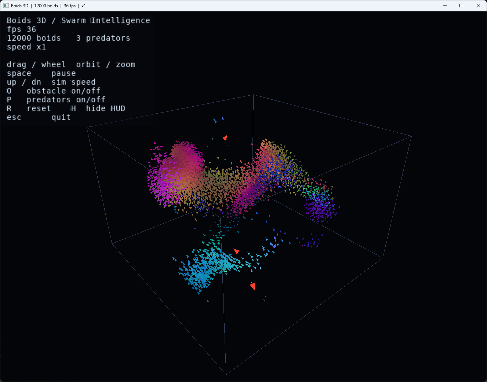

# Boids 3D — Swarm Intelligence

A real-time 3D flocking simulation written from scratch in C++ with a native
Win32 + OpenGL viewer. Tens of thousands of agents self-organise into flowing,
swirling flocks using only three local rules — no global coordination, no
external libraries. Predators dive through the swarm and it splits and reforms
around them, exactly like a starling murmuration under attack.



## Highlights

- **Reynolds boids in 3D** — separation, alignment and cohesion, each a local
  steering rule, producing emergent flocks from simple agents.
- **Predators** — hunters that chase the nearest boid; the flock tears open and
  closes back up around them. This is the visual payoff.
- **Scales to ~12k+ agents** — neighbour queries run through a uniform spatial
  hash (counting sort, O(N)), and the whole step is multi-threaded with a tiny
  `std::thread` pool. No rayon, no TBB.
- **Oriented rendering** — every agent is drawn as a small arrowhead pointing
  along its velocity and coloured by heading, so aligned sub-flocks read as
  coherent colour and you can see the flow direction at a glance.
- **Optional obstacle** — a sphere the flock has to stream around.
- **On-screen HUD** — live FPS, population, and the full key legend, drawn with
  an embedded bitmap font (no GDI, no external font files).
- **Zero dependencies** — links only `opengl32`, `gdi32`, `user32` from the
  Windows SDK. Modern GL entry points are resolved at runtime.

## Build & run

1. Open `BoidsViewer.sln` in **Visual Studio 2022**.
2. Select **Release | x64**.
3. Run with **Ctrl+F5**.

Release matters — Debug is far too slow for this many agents. Run on a machine
with real GPU drivers (OpenGL 3.3+); it will not work over Remote Desktop.

If Visual Studio reports the **v143** toolset is missing, right-click the
solution -> *Retarget solution* and pick your installed toolset.

There is no CMake build here; the project is Windows-only by design (native
Win32 windowing + WGL context).

## Controls

| Input | Action |
| --- | --- |
| Left-drag | Orbit the camera |
| Mouse wheel | Zoom |
| `Space` | Pause / resume |
| `Up` / `Down` | Simulation speed (substeps per frame) |
| `O` | Toggle the spherical obstacle |
| `P` | Toggle predators on / off |
| `R` | Reset |
| `H` | Show / hide the HUD |
| `Esc` | Quit |

## How it works

### Steering

Each boid carries a position and a velocity. Every step it looks at the
neighbours inside its perception radius and combines three Reynolds rules:

- **Separation** — steer away from neighbours that are too close (weighted by
  inverse square distance, so crowding is punished hard).
- **Alignment** — match the average heading of nearby boids.
- **Cohesion** — drift toward the local centre of mass.

On top of that there is a soft turn-around force near the box walls, a flee
force away from any predator inside the flee radius, and an optional push away
from the obstacle. The forces are summed into an acceleration, each rule is
clamped to a maximum steering force, speed is clamped to a `[min, max]` band so
agents never stall or run away, and position is integrated forward.

Predators run a simple seek toward the nearest boid (found through the same
spatial hash) with their own speed and turn limits.

### Neighbour search

The naive all-pairs version is O(N^2) and dies past a couple thousand agents.
Instead the boids are bucketed into a uniform grid whose cell size equals the
perception radius, built each frame with a counting sort. A neighbour query
then only visits the 3x3x3 block of cells around an agent — O(N) overall and
cache-friendly. The per-agent work (sense + steer) is split across hardware
threads; acceleration and integration are separated into phases so there are no
data races.

### Rendering

The simulation lives in continuous space. Each frame the viewer builds a small
camera-facing arrowhead per agent, oriented along its velocity, and uploads the
triangles in one streaming buffer. Colour comes from the normalised heading
(plus a brightness boost from speed), which makes locally aligned groups share
a colour and turns the whole flock into a shifting field of colour domains.
Predators are larger red darts. A wireframe box bounds the domain, and the HUD
is a second screen-space pass using an embedded font atlas.

## Verification

The flocking core is checked headless (see `src/verify.cpp`), which is useful
because the renderer can't be unit-tested:

- **Spatial hash correctness** — neighbour counts from the grid are compared
  against a brute-force O(N^2) reference and must match exactly.
- **Flock dynamics** — the Vicsek order parameter (mean normalised velocity) is
  tracked over time. It starts near zero for a random cloud and rises as the
  flock aligns; mean nearest-neighbour distance settles to a stable value
  (separation prevents collapse, cohesion prevents dispersal); speeds stay
  inside the configured band.

Build and run it separately if you want the numbers:

```
cl /std:c++20 /O2 /EHsc /I src src\boids.cpp src\verify.cpp /Fe:verify.exe
```

## Tuning

All of the behaviour lives in `BoidsParams` (`src/boids.hpp`):

| Field | Meaning |
| --- | --- |
| `boids`, `predators` | Population sizes |
| `perception` | Neighbour radius — larger gives bigger, smoother flocks |
| `separationDist` | Personal space |
| `wSeparation`, `wAlignment`, `wCohesion` | The three Reynolds weights |
| `maxSpeed`, `minSpeed`, `maxForce` | Agility and speed band |
| `fleeRadius`, `wFlee` | How sharply boids react to predators |
| `obstacle`, `obstacleCenter`, `obstacleRadius` | The sphere obstacle |

The defaults are tuned for large, sweeping flocks.

## Project layout

```
src/
  vec3.hpp         3D vector maths
  mat4.hpp         matrices + orbit camera
  hashgrid.hpp     uniform spatial hash (counting sort)
  boids.hpp/.cpp   flock + predators + obstacle, multi-threaded
  viewer_win32.cpp native Win32 + WGL viewer (arrowheads, box, HUD)
  font_atlas.hpp   embedded bitmap font for the HUD
  verify.cpp       headless correctness / dynamics checks
```

## Technical notes

- **Native Win32 + WGL** — the window, input loop and GL context are all set up
  by hand; there is no GLFW/GLAD/GLEW. Modern GL functions are loaded at runtime
  via `wglGetProcAddress`.
- **C++20**, no third-party dependencies.
- The work scales across cores with a hand-rolled thread pool.

## License

See `LICENSE`.

## Support

If you found this project interesting or useful, you can support my work:

[](https://github.com/sponsors/makarov-mm)